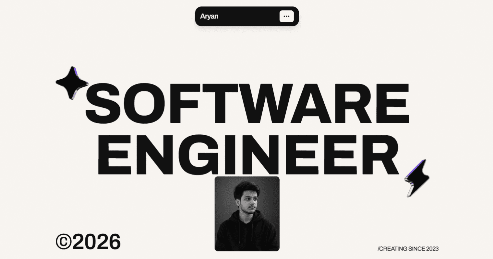
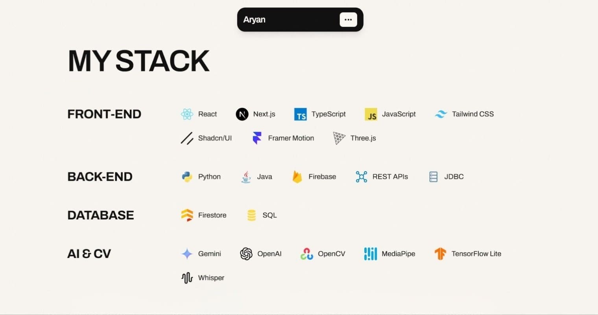
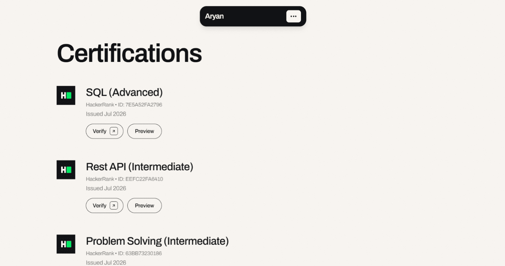
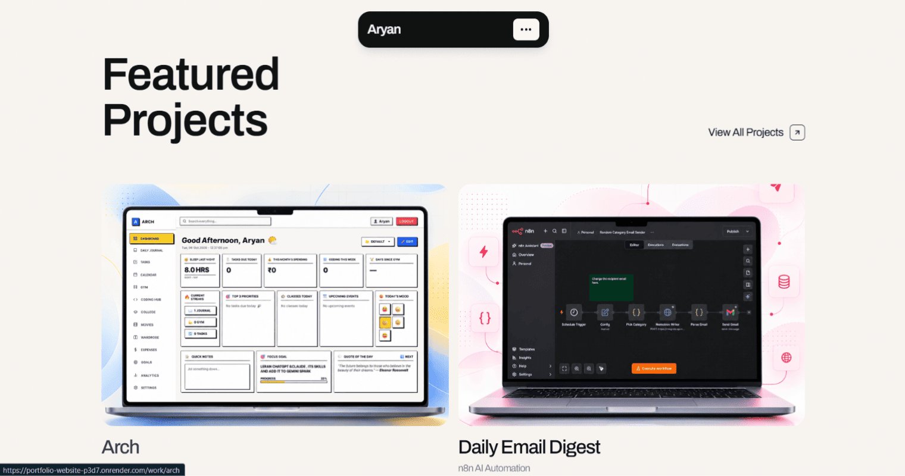
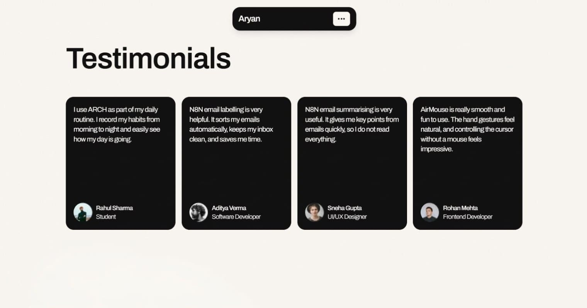
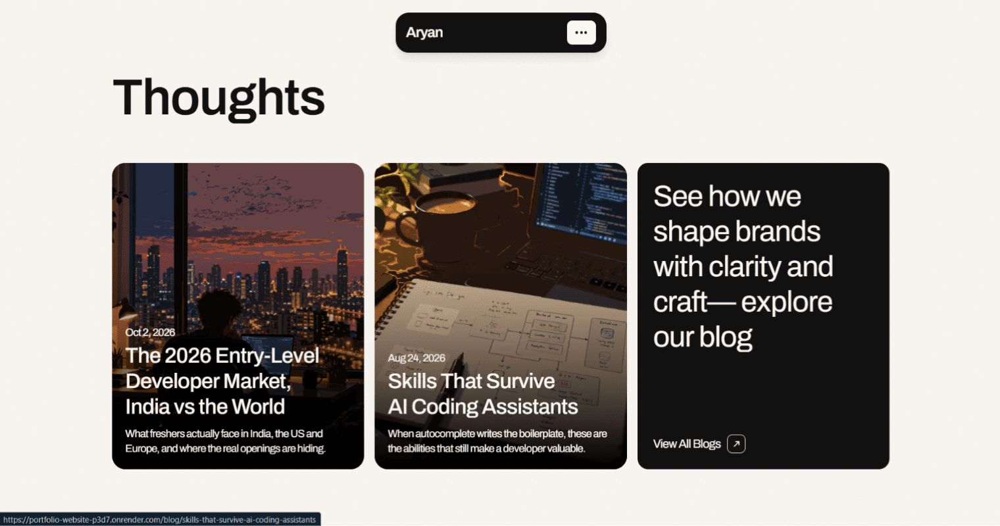
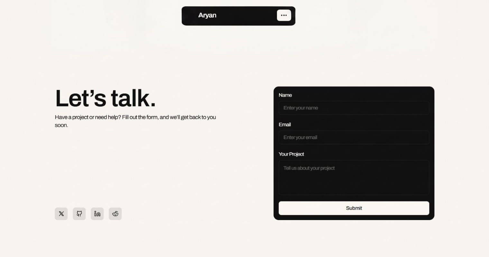
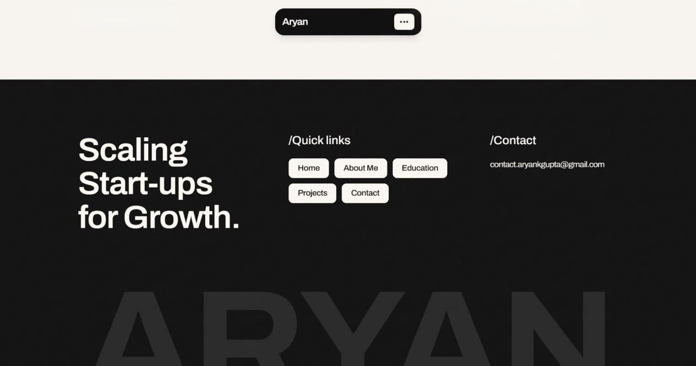

<div align="center">

  

  # Aryan Gupta | SWE

  <p align="center">
    <strong>A high-performance, responsive software engineering portfolio and interactive design experience built with React, TypeScript, and modern web tools.</strong>
  </p>

  <p align="center">
    <a href="LICENSE"></a>
    <a href="https://react.dev/"></a>
    <a href="https://www.typescriptlang.org/"></a>
    <a href="https://vitejs.dev/"></a>
    <a href="https://tailwindcss.com/"></a>
    <a href="https://render.com/"></a>
  </p>

  <p align="center">
    <em>Crafted with precision, thoughtful typography, and smooth micro-interactions.</em>
  </p>

  <p align="center">
    <strong>🔗 Live Demo: <a href="https://portfolio-website-p3d7.onrender.com/">portfolio-website-p3d7.onrender.com</a></strong>
  </p>

</div>

---

## 📖 Table of Contents

- [📸 Preview](#-preview)
- [✨ About The Project](#-about-the-project)
  - [🎯 For Visitors & Recruiters](#-for-visitors--recruiters)
  - [💻 For Developers](#-for-developers)
- [🚀 Key Features](#-key-features)
- [🛠️ Tech Stack](#️-tech-stack)
- [📂 Project Structure](#-project-structure)
- [🏁 Getting Started](#-getting-started)
  - [Prerequisites](#prerequisites)
  - [Installation](#installation)
  - [Environment Variables](#environment-variables)
  - [Development Server](#development-server)
  - [Production Build](#production-build)
- [📬 Contact Form Setup (Web3Forms)](#-contact-form-setup-web3forms)
- [🌐 Deployment (Render)](#-deployment-render)
- [🤝 Contributing](#-contributing)
- [📄 License](#-license)
- [📫 Contact & Connect](#-contact--connect)

---

## 📸 Preview

<p align="center">
  <em>A quick look at the website on desktop, tablet and mobile.</em>
</p>

<!-- Images folder: ./public/website-img -->
<table align="center" width="100%">
  <tr>
    <td align="center" width="50%">
      
      <br />
      <sub>Hero Section</sub>
    </td>
    <td align="center" width="50%">
      
      <br />
      <sub>Tech Stack</sub>
    </td>
  </tr>
  <tr>
    <td align="center" width="50%">
      
      <br />
      <sub>Certifications</sub>
    </td>
    <td align="center" width="50%">
      
      <br />
      <sub>Featured Projects</sub>
    </td>
  </tr>
  <tr>
    <td align="center" width="50%">
      
      <br />
      <sub>Testimonials</sub>
    </td>
    <td align="center" width="50%">
      
      <br />
      <sub>Thoughts & Articles</sub>
    </td>
  </tr>
  <tr>
    <td align="center" width="50%">
      
      <br />
      <sub>Contact Section</sub>
    </td>
    <td align="center" width="50%">
      
      <br />
      <sub>Footer</sub>
    </td>
  </tr>
</table>

---

## ✨ About The Project

Welcome to my personal developer portfolio! This website is designed to be more than just a static resume—it is a fast, interactive digital home that showcases real-world software engineering work, hands-on artificial intelligence projects, and technical writing.

### 🎯 For Visitors & Recruiters

If you are a recruiter, hiring manager, or visitor browsing my work:
- **Hero & Story**: Learn about my background, technical focus, and passion for building reliable software.
- **Featured Projects**: Explore case studies with live demos, GitHub repositories, and breakdown of problem-solving decisions.
- **Education & Certifications**: View verified credentials with inline modal previews and verification links.
- **Thoughts & Articles**: Read technical blogs covering AI engineering, developer career paths, and software fundamentals—complete with reading tracking and click-to-expand image lightboxes.
- **Get in Touch**: Send a direct message through the built-in contact form without leaving the page.

### 💻 For Developers

Under the hood, this application demonstrates clean frontend architecture and performance engineering:
- **Sticky Pinned Scroll Orchestration**: A continuous 200vh pinned track in the Hero section featuring dynamic crossfade transitions between portrait states.
- **Kinetic Text Scrubbing**: Word-by-word opacity transitions driven directly by viewport scroll progress.
- **Normalized Momentum Scrolling**: Powered by **Lenis** with intelligent locks during modal presentation.
- **Accessible Interactions**: ARIA-compliant modals, trapped keyboard navigation (`Tab` / `Escape`), and reduced-motion detection.

---

## 🚀 Key Features

- 📱 **Fully Responsive Layout**: Hand-tailored experiences across Mobile (`390px`), Tablet (`810px`), and Desktop (`1280px`).
- 🎬 **200vh Pinned Hero Track**: Sticky narrative introduction with layered content animation.
- 🖼️ **Click-to-Expand Image Lightbox**: Accessible, full-screen lightbox modal for article visuals with backdrop dismissal and scroll-locking.
- ⏱️ **Read History Tracker**: LocalStorage-backed reading state that informs visitors when they previously read an article.
- 📬 **Live Contact Form**: Client-side validation, rate-limiting (30s cooldown, max 2 messages per visitor), and bot-deterring honeypot fields powered by **Web3Forms**.
- 📜 **Inline Certificate Previews**: Modal PDF previewer for credentials with direct verification links.
- 🎨 **Editorial Aesthetics**: Subtle organic film-grain overlay, curated typography (`Archivo` & `Clash Grotesk`), and bespoke warm cream (`#FAF7F3`) theme palette.
- 🌓 **Adaptive Favicons**: Dynamic SVG favicon switcher responding to user operating system dark/light preferences.

---

## 🛠️ Tech Stack

<p align="center">
  
</p>

| Category | Technology | Purpose |
| :--- | :--- | :--- |
| **Frontend Framework** | [React 18](https://react.dev/) | Component-based UI architecture & state management |
| **Type Safety** | [TypeScript](https://www.typescriptlang.org/) | Strict typing across components, models, and data collections |
| **Build Tooling** | [Vite 5](https://vitejs.dev/) | Lightning-fast HMR and optimized Rollup production bundling |
| **Styling & Design System** | [Tailwind CSS 3](https://tailwindcss.com/) | Utility-first responsive styling and typography tokens |
| **Motion & Animation** | [Framer Motion](https://www.framer.com/motion/) | Spring-based physics, layout animations, and gesture interactions |
| **Smooth Scrolling** | [Lenis](https://lenis.darkroom.engineering/) | Momentum-based, buttery smooth scroll normalization |
| **Routing** | [React Router v6](https://reactrouter.com/) | Client-side routing with scroll restoration and dynamic route params |
| **Form Backend** | [Web3Forms](https://web3forms.com/) | Serverless form submission delivery directly to email |
| **Icons** | [Lucide React](https://lucide.dev/) | Clean, consistent SVG iconography |

---

## 📂 Project Structure

```text
portfolio-website/
├── public/                       # Static public assets served at root
│   ├── website-img/              # README preview screenshot assets (2x4 grid)
│   ├── projects/                 # Case study high-res screenshot galleries
│   ├── logos/                    # Tech stack brand vector SVGs
│   ├── education/                # Academic crests and institution brand marks
│   ├── pdf/                      # Certificate PDF documents & credentials
│   ├── black.svg                 # Brand monogram logo & light-mode favicon
│   ├── white.svg                 # Brand monogram logo & dark-mode favicon
│   ├── avatar.png                # Circular profile portrait asset
│   ├── resume.pdf                # Downloadable curriculum vitae PDF
│   └── _redirects                # Static host rewrite rules (SPA routing)
├── src/
│   ├── assets/                   # Bundled graphics, textures, and illustrations
│   │   ├── blog/                 # Blog post hero graphics and SVG figures
│   │   ├── contribute/           # Coffee illustrations, steam SVGs & QR graphics
│   │   └── grain.png             # Film-grain noise overlay texture
│   ├── components/               # Reusable atomic UI components
│   │   ├── Navbar.tsx            # Floating navigation bar with mobile drawer
│   │   ├── Footer.tsx            # Typographic footer with social & repo links
│   │   ├── CoffeeSupportButton.jsx # Floating tip button with animated coffee & steam
│   │   ├── PaymentModal.tsx      # Modal dialog with UPI QR code donation options
│   │   ├── BackButton.tsx        # Micro-interactive return navigation button
│   │   ├── ScrollManager.tsx     # Window scroll position restoration on route change
│   │   ├── ImageLightboxModal.tsx # Accessible full-screen image lightbox modal
│   │   ├── ResumeModal.jsx       # Embedded PDF resume viewer modal
│   │   └── AnimatedArrowBox.tsx  # Directional action arrow with hover physics
│   ├── config/                   # Site configuration, spacing tokens & typography
│   ├── data/                     # Structured content datasets
│   │   ├── work.ts               # Case studies, project metadata & deliverables
│   │   ├── articles.js           # Technical blog posts, reading metrics & markdown
│   │   ├── techStackData.ts      # Categorized skills, tools, and proficiencies
│   │   ├── educationData.ts      # Academic credentials and certified coursework
│   │   ├── testimonials.ts       # Peer & client recommendations and feedback
│   │   └── services.ts           # Architectural services and engineering offerings
│   ├── hooks/                    # Custom React hooks (Favicon, Document Title)
│   ├── pages/                    # Route page components
│   │   ├── Home.tsx              # Landing page orchestrating hero, work & sections
│   │   ├── WorkArchive.tsx       # Comprehensive project gallery & case study catalog
│   │   ├── WorkDetail.tsx        # In-depth case study breakdown with media galleries
│   │   ├── BlogArchive.tsx       # Articles catalog with category filtering
│   │   ├── BlogArticle.jsx       # Dynamic reading layout with lightbox & history
│   │   ├── Contribute.tsx        # Support & tip page with interactive UPI QR donation
│   │   └── NotFound.tsx          # Custom 404 error page
│   ├── sections/                 # Modular landing page sections
│   │   ├── HeroBioSection.tsx    # Narrative bio, portrait & live status indicators
│   │   ├── ProjectsSection.tsx   # Curated featured projects showcase
│   │   ├── CertificationsSection.tsx # Verified credentials showcase with PDF modals
│   │   ├── TechStackSection.tsx  # Interactive technical skills & toolsets
│   │   ├── ServicesSection.tsx   # Software engineering & design service offerings
│   │   ├── TestimonialsSection.tsx # Peer recommendations & client endorsements
│   │   ├── BlogSection.tsx       # Recent articles and technical thoughts preview
│   │   └── ContactSection.tsx    # Live contact form with Web3Forms integration
│   ├── types/                    # Shared TypeScript interfaces (CMS, Project, Post)
│   ├── utils/                    # Utility helpers (read history, animation flags)
│   ├── App.tsx                   # App root, routing hierarchy & Lenis smooth scroll
│   ├── Hero.jsx                  # Pinned 200vh hero track with kinetic text scrubbing
│   ├── index.css                 # Global styles, font definitions & CSS variables
│   └── main.tsx                  # Application bootstrap entry point
├── .env.example                  # Environment variable reference template
├── .gitignore                    # Git exclusion rules for clean repository state
├── index.html                    # Single-page application HTML entrypoint
├── LICENSE                       # MIT License
├── package.json                  # Dependencies, build scripts, and metadata
├── tailwind.config.js            # Design tokens, custom breakpoints & theme colors
├── tsconfig.json                 # TypeScript compiler options
└── vite.config.ts                # Vite dev server and build configuration
```

---

## 🏁 Getting Started

Follow these steps to run the portfolio locally on your machine.

### Prerequisites

- [Node.js](https://nodejs.org/) (version `18.x` or higher recommended)
- [npm](https://www.npmjs.com/) (bundled with Node.js) or `pnpm` / `yarn`

### Installation

Clone the repository and install dependencies:

```bash
git clone https://github.com/aryankumar-04/portfolio-website.git
cd portfolio-website
npm install
```

### Environment Variables

Copy the example environment file:

```bash
cp .env.example .env
```

Open `.env` and set your Web3Forms access key (required for the contact form to work):

```env
VITE_WEB3FORMS_ACCESS_KEY=your_web3forms_access_key_here
```

Get a free key at [web3forms.com](https://web3forms.com/). When deploying to Render, add this variable under **Environment → Environment Variables** in the Render dashboard.

### Development Server

Launch the Vite local development server:

```bash
npm run dev
```

Open your browser and navigate to `http://localhost:3000`.

### Production Build

Compile TypeScript and build the optimized production assets:

```bash
npm run build
```

The compiled static files will be generated in the `dist/` directory. You can preview the production bundle locally with:

```bash
npm run preview
```

---

## 📬 Contact Form Setup (Web3Forms)

The contact form uses [Web3Forms](https://web3forms.com/) for serverless email forwarding:

1. Visit [Web3Forms](https://web3forms.com/) and enter your email address to generate a free Access Key.
2. Set the key as `VITE_WEB3FORMS_ACCESS_KEY` in your `.env` file locally, and in Render's **Environment → Environment Variables** for production.
3. **Security Recommendation**: In your Web3Forms dashboard, restrict the key to your live domain to prevent spam submissions from third-party sites.

---

## 🌐 Deployment (Render)

This repository is optimized for one-click deployment on [Render](https://render.com/) as a **Static Site**:

1. Fork or push this repository to your GitHub account.
2. Sign in to the [Render Dashboard](https://dashboard.render.com/).
3. Click **New +** > **Static Site**.
4. Connect your `portfolio-website` repository.
5. Configure the build parameters:
   - **Name**: `portfolio-website`
   - **Branch**: `main`
   - **Build Command**: `npm run build`
   - **Publish Directory**: `dist`
6. Under **Redirects/Rewrites**, create an SPA catch-all rule:
   - **Type**: `Rewrite`
   - **Source**: `/*`
   - **Destination**: `/index.html`
7. Click **Create Static Site**. Render will build and deploy your site automatically on every push!

*(Note: The repository also includes a `public/_redirects` file that static hosts like Render and Cloudflare Pages automatically respect for client-side routing).*

---

## 🤝 Contributing

Contributions, issues, and feature suggestions are welcome!
Feel free to open an issue or submit a pull request if you notice anything that could be improved.

1. Fork the Project
2. Create your Feature Branch (`git checkout -b feature/AmazingFeature`)
3. Commit your Changes (`git commit -m 'Add some AmazingFeature'`)
4. Push to the Branch (`git push origin feature/AmazingFeature`)
5. Open a Pull Request

---

## 📄 License

Distributed under the **MIT License**. See [`LICENSE`](LICENSE) for full details.

```text
Copyright (c) 2026 Aryan Kumar Gupta
```

---

## 📫 Contact & Connect

<div align="center">

  <h3>Aryan Kumar Gupta</h3>
  <p>Software Engineer & AI Enthusiast</p>

  <p>
    <a href="mailto:contact.aryankgupta@gmail.com"></a>
    <a href="https://linkedin.com/in/aryankumargupta04"></a>
    <a href="https://github.com/aryankumar-04"></a>
    <a href="https://x.com/aryankumar_04"></a>
  </p>

  <p><em>Thank you for visiting my portfolio! Have a project in mind or want to collaborate? Feel free to reach out.</em></p>

</div>
